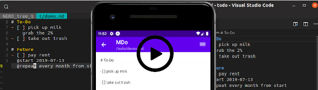

<style>
  #mdo-demo textarea {
    width: 40%;
    height: 15em;
    padding-top: 0.5em;
    line-height: 1.25em;
  }
  #mdo-demo textarea:first-child {
    margin-right: 2%;
  }
  #mdo-demo button {
    display: block;
    margin-top: 0.5em;
    width: 6em;
    height: 2.1em;
    outline: none;
  }
</style>

# MDo

MDo is a free, open source to-do app built to live inside your editor.

<a href="https://www.youtube.com/watch?v=kUKnBZfdXbY" target="_blank">
  
</a>

## Try it out

<div id="mdo-demo"></div>

## How does it work

- You have a single file with all your tasks.
- The file is parsed into blocks:

  - Any line that starts with `- [ ]` marks the start of an incomplete task
    block.
  - Any line that starts with `- [X]` marks the start of a complete task
    block.
  - Any line that starts with `#` marks the start of a comment block.

Example:

```
# Home                                            | << Start of comment block
This content is considered part of the comment    |
block. Use it to keep any information you'd like  |
hanging around.                                   | >> End of comment block
                                                  | <> Padding block
- [ ] Task title                                  | << Start of incomplete task
  Any content below the task title is considered  |
  the body of the task.                           |
                                                  |
  Feel free to use newlines, indentations, or any |
  other format you prefer here.                   | >> End of incomplete task
- [X] Some other task                             | << Start of complete task
  This task is considered complete.               | >> End of complete task
                                                  | <> Padding block
# Work                                            | <> One-line comment block
- [ ] Do something                                | <> One-line task
```

## Future and recurring tasks

MDo supports adding metadata to your tasks by using tags.
The following tags are supported:

- `@start`: date/time when the task should start showing up in your "to-do" section.
- `@repeat`: indicates how often the task should repeat.
- `@postpone`: postpone lets you hide a task until a future time, without
  modifying the `@start` value.  
   This is useful for those tasks that recur based on start date, but for some
  reason you can't work on at this moment.

Examples:

```
- [ ] Pay rent
    @start 2018-09-01
    @repeat every month from start
- [ ] Take out trash
    @start today at 8pm
    @repeat every day from complete
    @postpone until Monday
```

See allowed formats for [start](https://github.com/mdo-org/mdo/blob/master/packages/mdo-plugin-start/allowed_formats.md), [repeat](https://github.com/mdo-org/mdo/blob/master/packages/mdo-plugin-repeat/allowed_formats.md), and [postpone](https://github.com/mdo-org/mdo/blob/master/packages/mdo-plugin-postpone/allowed_formats.md)

[> Installation](/installation/)
